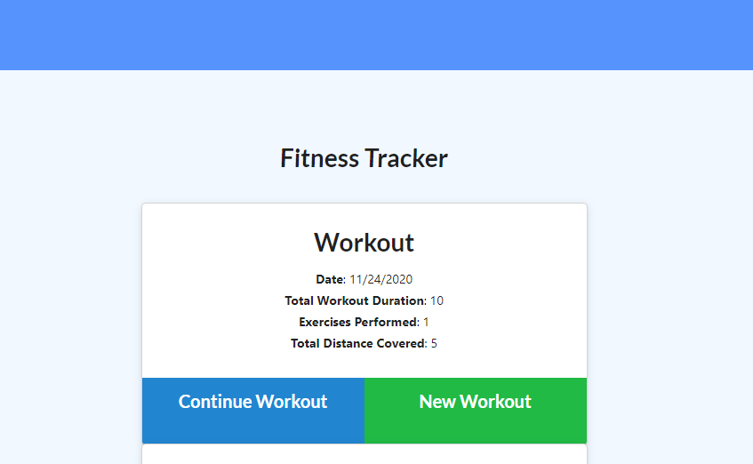
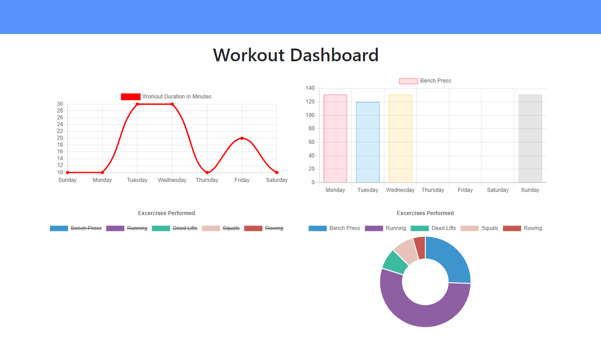

# Unit 17: Workout Tracker


Allows the user to track a workout. Various attributes of the workout can be stored. I did the best I could.

## Description

Created a fitness tracking app utilizing Node.js, Express.js, MongoDB, Heroku and Mongoose. Allows the user to track their workouts and save them in a database.

## Live site:

https://hw17workouttracker.herokuapp.com/

## Images

Image of main view:


Image of adding exercises:


Image of Workout Dashboard


## Installation

To install necessary dependencies, run the following command:

```
npm i
```

You will need to run "npm i" to recieve all the required node modules.

## Usage

The primary reason for this app was because it was a homework requirement.
